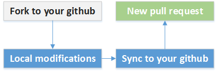

1. 介绍
===
`CortanaOS`开源项目致力于为开发者提供业界一流的ROM适配工具。

2. 分支命名
===
开源项目的分支命名与Android版本对应,目前支持**Android 5.1**的机型适配，分支名为：`android-5.1`

目录结构如下所示: 

    CortanaOS
     +-- manifest           项目清单
     +-- tutorials          教程文档
     +-- plugins            扩展插件，用于扩展已有功能
     +-- build              编译环境，用于构建和编译机型
     +-- tools              适配工具
     +-- cortana            CortanaOS相关，内容定期更新
          +-- release       CortanaOS开发者提供的ROM包
          +-- overlay       资源覆盖
     +-- devices            机型目录
          +-- base          CortanaOS开发者提供的默认机型
          +-- your_device   待第三方开发者适配的机型

3. 代码下载
===

通过repo init命令的-b参数, 选择需要下载的分支。
通过repo sync命令同步远程代码: 

    $ repo init -u https://github.com/CortanaOS/manifest.git -b android-5.1
    $ repo sync -c -j4

如果连接一直失败或下载代码过慢，则使用以下命令:

    $ repo init --repo-url git://github.com/CortanaOS/repo.git \
                -u https://github.com/CortanaOS/manifest.git \
                -b android-5.1 --no-repo-verify
    $ repo sync --no-clone-bundle -c -j4

4. 机型适配
===
<b>* 标准流程</b>

下载完代码以后, 在开源项目根目录, 执行以下命令初始化开发环境: 

    $ source build/envsetup.sh

创建一个新的机型工程的目录(以demo为例), 后续的移植都在机型目录完成。

    $ mkdir -p devices/demo
    $ cd devices/demo

按照如下步骤，完成一个新机型的适配：

    $ cortana config      # 生成机型配置文件Makefile
    $ cortana newproject  # 生成新机型目录
    $ cortana patchall    # 自动插桩
    $ cortana fullota     # 生成适配完成的ROM包

<b>* 冲突处理</b>

自动插桩可能会造成代码合并冲突。冲突会以下面的形式标注出来, 开发者需要在厂商的文件中手工解决这些冲突。

    <<<<<<< VENDOR
      原厂的代码块
    =======
      Cortana的代码块
    >>>>>>> BOSP

<b>* 版本升级</b>

可以跟随官方发布的最新ROM包，将已经是适配完成的机型升级到最新版本：

    $ cortana cleanall
    $ Cortana upgrade

5. 贡献代码
===

我们鼓励开发者为开源社区作出贡献。利用Github的Pull-Request机制，便可将内容变更发送给CortanaOS开发者。

- 首先，在github页面上，点击“Fork”，将Cortana的git库拷贝到自己账户
- 然后，对拷贝的git库进行修改，将内容变更提交到自己的账户
- 最后，在github页面上，点击"New pull request"，向Cortana官方发起代码审阅
